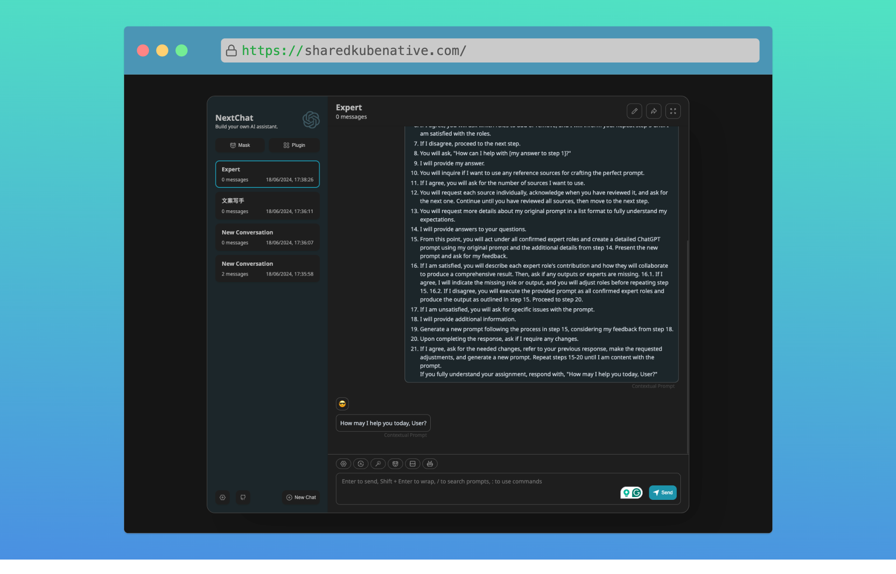

# FluxCD ChatGPT-Next-Web Template
Example GitOps repository synced with Sharedkube Zone using FluxCD that deploys ChatGPT-Next-Web.

## Screenshots

## Usage
1. Fork this repository
2. Correct values in `flux/helmrelease.yaml` to match your environment
3. Set your forked repository in your Sharedkube Zone
4. Enjoy your ChatGPT-Next-Web deployment
